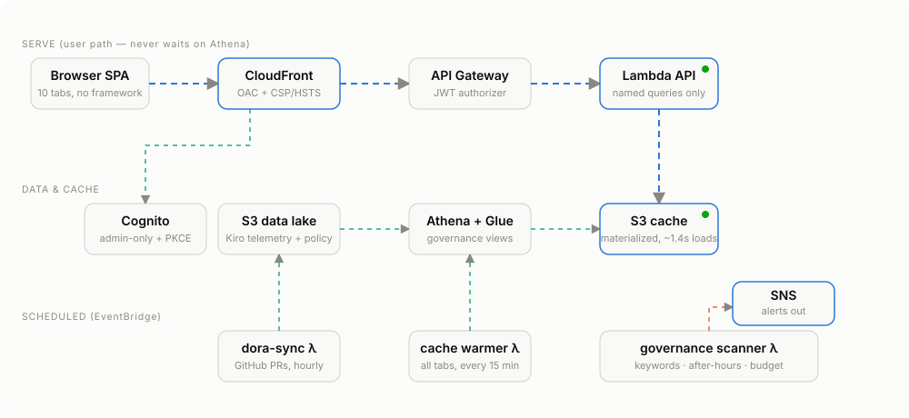

# Kiro Telemetry Dashboard

> **Community sample — not an official AWS product or service.** Provided
> as-is under the MIT-0 license. "Kiro" and "Amazon Q" are AWS trademarks;
> this project is an independent, community-maintained tool for working with
> the telemetry those products emit.

A production-grade, security-first web dashboard for **Kiro developer-telemetry
governance** — self-hosted on AWS serverless, no BI license required.

This repo is self-contained: the data layer (Glue database, Athena workgroup
with cost guardrails, identity sync, DDL) plus the **presentation + API +
automation layer** on top. It supersedes
[kiro-telemetry-governance](https://github.com/timwukp/kiro-telemetry-governance)
(now archival), whose still-useful pieces were folded in here:



## What you get

**Ten dashboard tabs**, all driven by real telemetry:

| Tab | What it answers |
|-----|-----------------|
| Architecture | Live system diagram with per-component health |
| Overview | KPI tiles: active users, credits, messages, sensitive-prompt rate |
| Usage & Adoption | DAU, credits/messages trends, client types, new users, automation share |
| Security & Compliance | Sensitive-keyword alerts, after-hours activity, audit trail |
| Prompt Quality | Prompt/response lengths, response ratio, trigger types, model distribution |
| Productivity | AI-generated code lines, inline acceptance rate, output mix, lines-per-credit ROI |
| Cost Governance | Credits by tier / team / project / cost center |
| Budget | Month-to-date burn, linear month-end forecast vs overage cap |
| DORA | PRs merged/day, time-to-merge, AI-assisted vs unassisted merge speed |
| Policy (admin) | MCP-server allowlist + global steering registry, versioned with audit |

**Performance by design (SPICE-style, serverless):** users never wait on
Athena. A scheduled warmer materializes every tab×window query result to S3
every 15 minutes; the API serves from that cache in ~1–2 s, stale-while-
revalidate. See `docs/architecture.svg` and the perf notes in the governance
repo's DESIGN_DECISIONS.

**Security posture:**

- No public S3 — CloudFront Origin Access Control only; TLS 1.2+, CSP,
  HSTS, frame-ancestors 'none'
- Same-origin API (`/api/*` behavior) — no CORS surface; direct
  `execute-api` calls rejected via an origin-verify secret
- Cognito: admin-created users only, PKCE code flow, 12+ char passwords,
  optional TOTP MFA, advanced security ENFORCED
- Lambda runs **named queries only** — the sole client input is
  `days ∈ {7,30,90}`; no SQL from the client, least-privilege IAM
- Policy writes require the Cognito `admins` group; every version carries
  `updated_by` / `updated_at`
- Tokens live in sessionStorage (never localStorage); the one-time PKCE
  flow state survives the Hosted-UI redirect safely

**Governance automation (EventBridge):**

- `governance scanner` (daily): sensitive keywords, after-hours activity,
  budget >80% of cap → SNS
- `dora-sync` (hourly): pulls PR/review data for the repos listed in the
  policy registry via a read-only GitHub PAT (SSM SecureString)
- `cache warmer` (15 min): refreshes the materialized S3 cache

## Repository layout

```
cloudformation/01_foundation.yaml Glue DB + Athena workgroup (import-ready) + scan-volume alarm
cloudformation/02_identity_sync.yaml Daily Identity Center -> user_mapping.csv sync (import-ready)
cloudformation/20_backend.yaml    Cognito, HTTP API, Lambdas, alarms, schedules
cloudformation/30_frontend.yaml   S3 + CloudFront (OAC, security headers)
lambda/api/                       Router, auth hardening, Athena executor, cache
lambda/scanner/                   Governance checks -> SNS
lambda/dora_sync/                 GitHub PR snapshot -> S3
lambda/user_mapping_sync/         Identity Center users -> mapping CSV (mirrors live code)
frontend/                         Vanilla-JS SPA (no framework, no build step)
sql/                              Athena DDL (enriched view, v2 tables, DORA)
sql/40_governance_runbook.sql     Ad-hoc admin queries (license, anomaly, incident)
docs/SECURITY.md                  Data protection + sensitive-keyword review SOP
scripts/deploy.sh                 Idempotent end-to-end deploy
scripts/kiro-policy-sync.sh       Client: installs org policy into ~/.kiro/
scripts/validate_offline.py       40+ offline security/consistency checks
tests/                            Unit tests (mocked boto3) + SVG geometry checks
```

## Deploy

Prerequisites: Kiro telemetry landing in S3, AWS CLI v2, python3, a region
with Athena engine v3. On a fresh account, deploy
`cloudformation/01_foundation.yaml` and `02_identity_sync.yaml` first (on an
account where these resources already exist unmanaged, adopt them via
CloudFormation resource import — see the template headers).

```bash
cp config/parameters.example.env config/parameters.env   # fill in your values
./scripts/deploy.sh                                      # idempotent, safe to re-run
```

The script deploys both stacks, uploads Lambda code, reconciles Athena
DDL, creates the first admin user (temporary password emailed), generates
`frontend/config.js` from stack outputs, and runs a smoke test.

For the DORA tab, create a **fine-grained GitHub PAT** (public repositories,
read-only is enough for public repos) and store it:

```bash
aws ssm put-parameter --name /kiro-dashboard/github-token \
  --type SecureString --value <token>
```

Tracked repos are managed on the Policy tab (admins only).

## Honest limits

- Kiro exposes **no public admin API**: model enforcement, MCP hard-blocking,
  and hooks enforcement are not possible from outside. This dashboard
  implements the officially supported alternative — file-based config
  distribution (`~/.kiro/settings/mcp.json`, `~/.kiro/steering/`) via
  `kiro-policy-sync.sh`, with telemetry audit as the compensating control.
  Workspace-level Kiro config can still override user-level config.
- The budget forecast is a labeled **linear extrapolation**, not ML.
- DORA lead time uses the merge-fallback definition (first commit → merge)
  because prompt telemetry has no deployment events; the UI says so.

## Verification

```bash
python3 scripts/validate_offline.py     # CFN security lint, SQL, frontend checks
python3 -m unittest discover tests      # handler + policy auth + SVG geometry
```

CI-grade e2e (optional): a Puppeteer script walking login → all tabs →
policy write is described in docs/TESTING.md.

## License

MIT-0. See [LICENSE](LICENSE).
